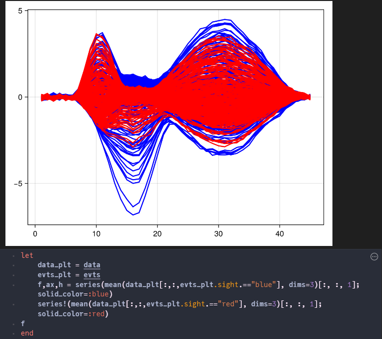
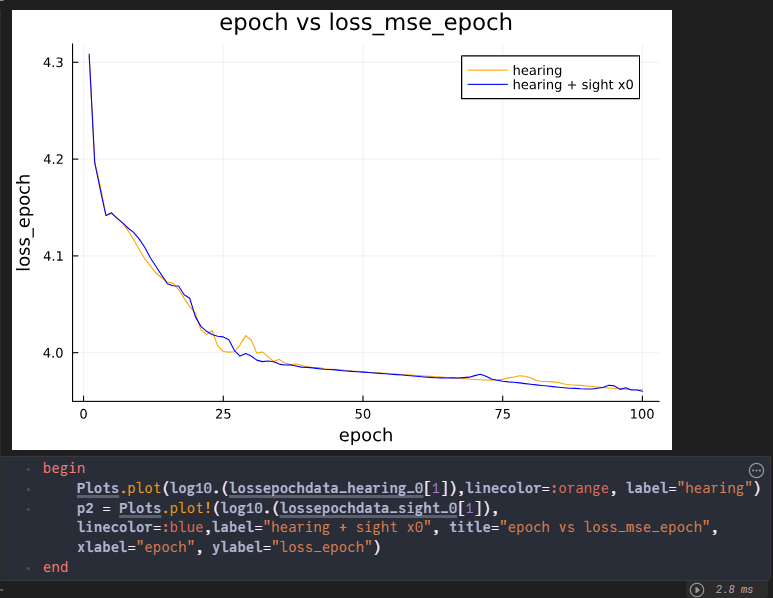

```@meta
EditURL = "../../../literate/tutorials/Autoencoder_EEG_Meeting_Minutes.jl"
```

# Autoencoder
### Team: Shaolong, Ramnath Rao Bekal, Rahul Bhaskaram
#### Date: 31/8/2024

#  1. Definition

# What is Autoencoder?

An autoencoder is a type of artificial neural network used to learn efficient representations of data,
typically for the purpose of dimensionality reduction or feature learning. It consists of two main parts:

1. **Encoder**: This part compresses the input data into a lower-dimensional representation,
     capturing the essential features while discarding noise and redundancy.
     The encoder typically reduces the input dimensions to a much smaller size.
2. **Decoder**: This part reconstructs the original input from the compressed representation.
     The goal of the decoder is to produce an output as close as possible to the original input data.

Autoencoders are trained using unsupervised learning, where the network learns to minimize the difference
between the input and the output (reconstruction error). They are widely used in applications such as data compression,
denoising, anomaly detection, and feature extraction.

# A List of Examples

### 1. Medical Imaging

- **Scenario**: A doctor needs to analyze a large set of medical
  images, such as MRIs, to detect any abnormalities.
- **Application**: Autoencoders can help enhance the image quality
  or highlight areas of concern, making it easier for doctors
  to identify potential health issues, such as tumors or fractures.

### 2. Face Recognition on Social Media

- **Scenario**: Social media platforms automatically tag people in photos.
- **Application**: Autoencoders can compress and extract essential
  features from images to recognize faces, making it easier
  to tag friends in photos without manual input.

### 3. Photo and Video Compression

- **Scenario**: When you want to save space on your smartphone or computer
  by compressing photos or videos.
- **Application**: An autoencoder can reduce the file size of images or
  videos while preserving important details, allowing you to store
  more files without significantly losing quality.

### 4. Noise Reduction in Audio

- **Scenario**: You have a recording from a crowded place, like a lecture
  or meeting, with a lot of background noise.
- **Application**: A denoising autoencoder can clean up the audio by
  filtering out the background noise, making the speech clearer
  and easier to understand.

### 5. Detecting Fraudulent Transactions

- **Scenario**: Banks want to monitor transactions for potential fraud,
  such as unusual spending patterns on a credit card.
- **Application**: An autoencoder trained on normal transaction data can
  identify transactions that significantly deviate from typical
  behavior, flagging them as potentially fraudulent.

## Key Concept

Autoencoders are a versatile tool in machine learning for tasks
such as dimensionality reduction, anomaly detection, and data compression.
They work by learning to encode the input data into a lower-dimensional
representation and then decode it back to its original form.

1.1 Learning Rate

- Too high a learning rate might cause the model to oscillate or even diverge during
  training, leading to poor convergence. This could result in poor quality of the graphics
  generated by the autoencoder, with significant loss of detail.
- Too low a learning rate might lead to excessively slow training and the model might
  get stuck in local minima. This could cause the autoencoder to generate overly
  smooth images that miss some important features.

1.2 Epoch Number

- Too few epochs might prevent the model from adequately learning the features in the
  data, affecting the quality and accuracy of the reconstructed graphics.
- Too many epochs might lead to overfitting where the model performs well on the
  training data but poorly on new, unseen data. An overfitted autoencoder might
  generate images that are too reliant on specific noise and details of the training data,
  instead of learning a more general representation of the data.

1.3 Batch Size

- Smaller batch sizes generally provide a more accurate gradient estimation but might
  lead to a less stable training process and longer training times. Smaller batches
  might enable the model to learn more details, potentially leading to better
  performance in image reconstruction tasks.
- Larger batch sizes can speed up training and stabilize gradient estimations but may
  reduce the generalization ability of the model during training. In autoencoders, too
  large a batch might result in reconstructed images that lack detail and appear more
  blurred or smooth.

1.4 Mean Squared Error (MSE)

- MSE is a commonly used metric to measure the average squared difference between the
  observed actual values (targets) and the values predicted by a model. The MSE loss
  rate is calculated as the mean of the squares of these differences. It quantifies how
  well the model's predictions match the actual data, with a lower MSE indicating better
  performance.

1.5 R-Squared Error (R²)

- R², also known as the coefficient of determination, is a statistical measure that indicates
  how well the variance in the dependent variable is explained by the independent variables
  in the model. It ranges from 0 to 1, with values closer to 1 indicating a better fit. R² loss
  rate is often used to describe the proportion of the variance that is not explained by
  the model.

#  2. Code Explanation

**1. First Formula:** Includes the effects of both sight and hearing
```julia
f = @formula 0 ~ 0 + sight + hearing
```

**2. Second Formula:** Includes only the effect of hearing
```julia
f_hearing = @formula 0 ~ 0 + hearing
```

**3. Third Formula:** Includes only the effect of sight
```julia
f_sight = @formula 0 ~ 0 + sight
```

```julia
╔═╡ 549d0f75-be94-4460-9085-022f35613b29
f = @formula 0 ~ 0 + sight + hearing

╔═╡ 9ce43061-34bb-4905-b7e2-8fc5f96222cb
f_hearing = @formula 0 ~ 0 + hearing

╔═╡ e28911d6-3313-4504-90af-0cccae9d0dd8
f_sight = @formula 0 ~ 0 + sight
```

To test and train the Deep Recurrent Encoder model, the following parameters are required:

- **Parameter 1**: Random number generator
- **Parameter 2**: Number of epochs
- **Parameter 3**: Sight effect, with values of 0 or 10
- **Parameter 4**: Time samples

The `simulate_data` function is used to create both the test and training datasets.

- `data_0` and `data_10` are the training datasets.
- `data_test_0` and `data_test_10` are the testing datasets.

Running the `simulate_data` function to create the datasets:

```julia
data, evts = testdata.simulate_data(rng, 100, 1; sfreq=100)

╔═╡ 2d073e94-e75f-4c46-950d-7fa9f4db244a
data_0, evts_0 = testdata.simulate_data(rng, 100, 0; sfreq=100)

╔═╡ a3dd7def-6c8c-47dc-8280-933e607e424d
data_test_0, evts_test_0 = testdata.simulate_data(rng, 100, 0; sfreq=100)

╔═╡ 374e0d33-0ad9-46ab-beb9-51b7e069ff89
data_10, evts_10 = testdata.simulate_data(rng, 100, 10; sfreq=100)

╔═╡ 81a879b6-1077-4044-8195-bcc0d6ce1341
data_test_10, evts_test_10 = testdata.simulate_data(rng, 100, 10; sfreq=100)
```

The R-squared error ranges from 0 to 1 and measures how closely the predicted values
match the actual values. A value closer to 1 indicates that the model's predictions are a good
fit with the actual data, while a value closer to 0 suggests a poor fit. In our case, the R-squared
value is close to 0 due to the influence of pink noise.

For the Mean Squared Error (MSE), the ideal value should be close to 0, indicating that the
predicted and actual models are a perfect match.

Additionally, we determined the best fit for the model using a batch size of 256 and 50
hidden channels.

To test and train the model
```julia
lossepochdata_hearing_0 = []
lossepochrsquareddata_hearing_0 = []
loss_test_rsquared_hearing_0 = []
y_pred_hearing_0 = zeros(Float64, 44, 227, 10)

# Training the model with 0 effect on sight
# dre,ps, st = fit(DRE, Float32.(data)) # |> CuArray)
dre, ps, st, lossepochdatahearing_0, lossepochrsquareddatahearing_0 = fit(DRE, Float32.(data_0[:,1:end÷2*2,:]) |> x->use_gpu ? CuArray(x) : x,
    f_hearing, evts_0; n_epochs=100, mask_percentage=0.1, lr=0.1, batch_size=256, hidden_chs=50) # |> CuArray)

# Testing the model with 0 effect on sight
l, y_pred_hearing_0[:,:,:] = DeepRecurrentEncoder.test(dre, (Float32.(data_test_0[:,1:end÷2*2,:]) |> x->use_gpu ? CuArray(x) : x),
    f_hearing, evts_test_0, ps, st; subset_index=1:10, mask_percentage=0.1, loss_function=mse)

push!(lossepochdata_hearing_0, lossepochdatahearing_0)
push!(lossepochrsquareddata_hearing_0, lossepochrsquareddatahearing_0)
push!(loss_test_rsquared_hearing_0, l)
```

# 3. Graphs and Results Explanation
Output of Predicted model


Output of Actual model


The red shape corresponds to a sight effect of 0, while the blue shape corresponds to a sight
effect of 10. As we can clearly observe, the blue shape is fuller and resembles a butterfly
more due to the larger sight effect.



The hearing + sight curve outperforms the hearing-only curve in terms of MSE loss,
as the hearing + sight curve is closer to 0.


As we can see, the hearing + sight*0 curve is similar to the hearing-only curve.
The small differences are due to the randomly generated dataset.



Test curve
R-square error curves for different hidden channels


Predict hearing with the effect value of 10


Training curve
MSE loss improves with more epochs or more hidden layers, as it gets closer to 0.


Training curve
R-squared loss improves with more hidden channels or more epochs. The R-squared value
hasn't reached 1 due to the presence of pink noise.


---

*This page was generated using [Literate.jl](https://github.com/fredrikekre/Literate.jl).*

