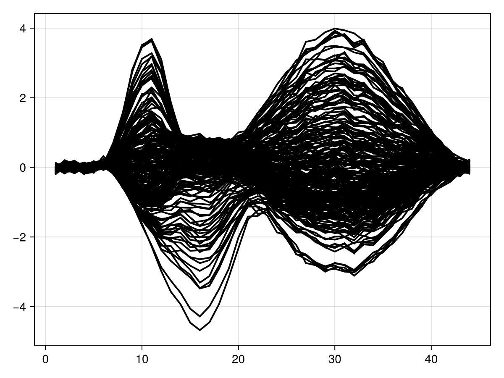
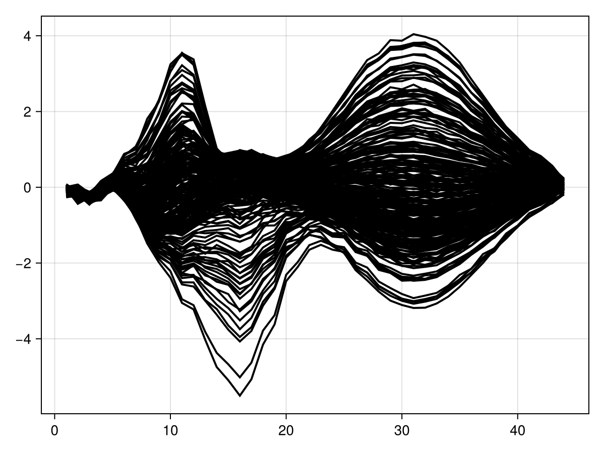
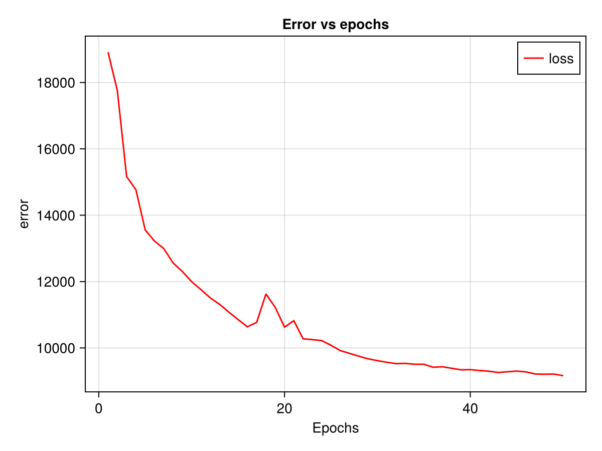

# Tutorial : Using the deep recurrent encoder

## Overview
This tutorial.jl notebook performs data simulation, trains a deep recurrent encoder model, and visualizes the results. It includes data preparation, model training, and evaluation steps.

## Dependencies
The notebook uses the following Julia packages:
- `Pkg` for package management
- `Random` for random number generation
- `PlutoLinks` for linking Pluto cells
- `Lux` and `LuxCUDA` for deep learning (CPU and GPU support)
- `CairoMakie` and `Plots` for visualization
- `Statistics` and `StatsModels` for statistical modeling
- `StableRNGs` for reproducibility
- `DeepRecurrentEncoder` for neural network modeling

## Notebook Workflow

### 1. Package Activation
```julia
using Pkg
Pkg.activate("../../docs")
```
This activates the package environment located in the `../../docs` directory.

### 2. Importing Required Libraries
```julia
using Random, PlutoLinks, Lux, LuxCUDA, CairoMakie, Statistics, StatsModels, Plots, StableRNGs
```
These libraries are used for data handling, model training, and visualization.

### 3. Importing Custom Deep Learning Module
```julia
@revise using DeepRecurrentEncoder
```
This imports the `DeepRecurrentEncoder` module for recurrent neural network training. The @revise tracks for changes done in the module to refresh the cells in the notebook

### 4. Loading Test Data
```julia
testdata = @ingredients("../testdata.jl")
```
This loads test data from `testdata.jl`.

### 5. Random Number Generator
```julia
rng = StableRNG(1)
```
A stable random number generator to simulate data from the UnfoldSim.jl package (<Link to unfold sim>) 

### 6. Defining Formula for Model
```julia
f = @formula 0 ~ 0 + sight + hearing
```
Defines a statistical formula to define the stimuli effects given to the model

### 7. Simulating Data
```julia
data, evts = testdata.simulate_data(rng, 100; sfreq=100, sight_effect=1);
```
Simulates samples of data using the random number generator and a given sight_effect. This controls on how much the "sight" stimulus influences the final EEG signal

### 8. GPU Toggle
```julia
use_gpu = false
```
A boolean flag to determine whether to use a GPU for training.

### 9. Model Training
```julia
x_train_data, train_evts, x_test_data, test_evts = train_test_split(data, evts)
data_input = Float32.(x_train_data[:, 1:end÷2*2, :]) |> x -> use_gpu ? CuArray(x) : x
loss = MSELoss()
dre, ps, st, loss_train, loss_opt = fit(DRE, data_input, f, train_evts; n_epochs=10, lr=0.1, batch_size=256, loss_opt=loss, hidden_chs=25)
```
- Splits the data into training and test sets.
- Converts training data to `Float32` format and optionally moves it to GPU (in case use_gpu) is true
- Defines mean squared error loss (Customizable).
- Trains the deep recurrent encoder model using given epochs, a given  learning rate, and a given batch size.

### 10. Model Testing
```julia
data_test = Float32.(x_test_data[:, 1:end÷2*2, :])
loss_pred, data_pred = DeepRecurrentEncoder.test(dre, data_test, f, test_evts, ps, st; subset_index=1:10, loss_function=mse)
```
- Converts test data to `Float32` format.
- Evaluates the trained model on the test dataset.

### 11. Visualization
#### Input Data Visualization
```julia
series((data_test[:, :, 10]); solid_color=:black)
```


#### Prediction Visualization
```julia
series(data_pred[:, :, 10]', solid_color=:black)
```


#### Training Loss Visualization
```julia
f_ = Figure()
ax1_ = Axis(f_[1, 1], xlabel="Epochs", ylabel="error", title="Error vs epochs")
lines!(ax1_, loss_train, label="loss", color=:red)
axislegend(ax1_)
f_
```
- Creates a figure to plot training loss over epochs.
- Uses `CairoMakie` to visualize the error reduction.



## Summary
This notebook:
- Loads and simulates time-series data.
- Defines and trains a deep recurrent encoder model.
- Evaluates the model on test data.
- Visualizes the input data, predictions, and training loss trends.


