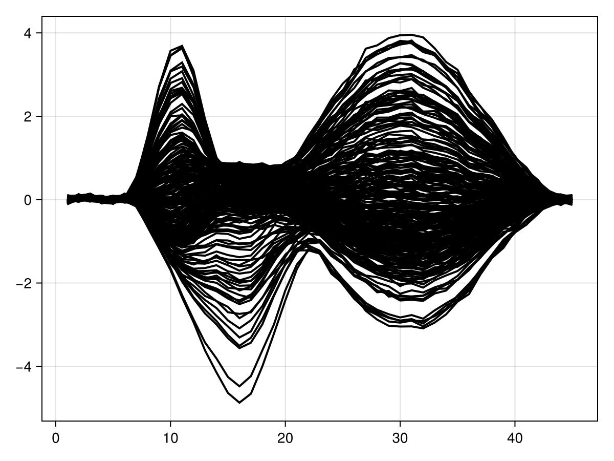
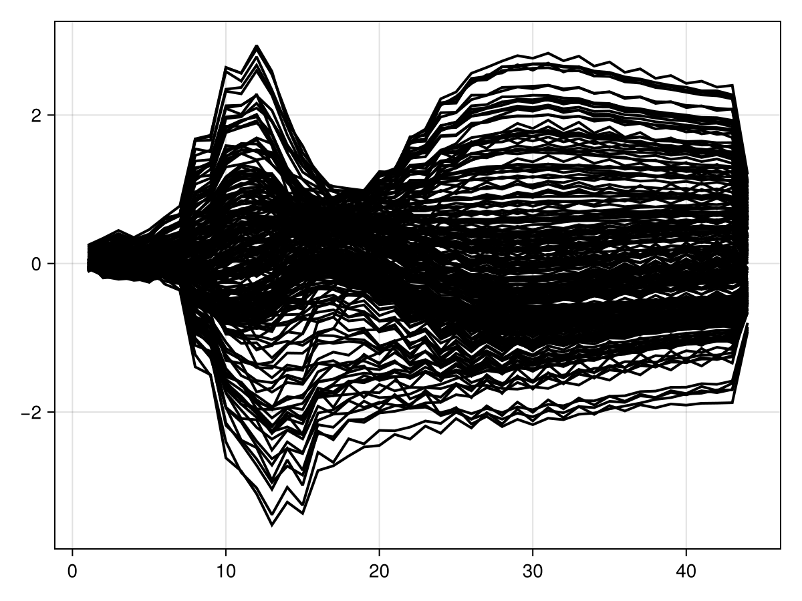
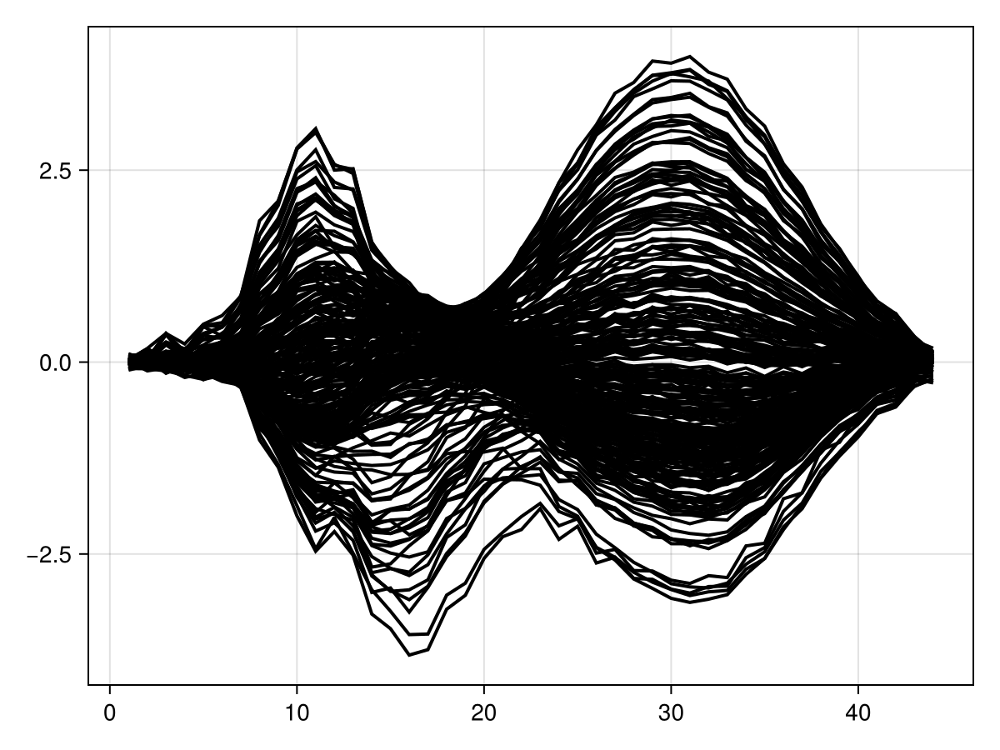
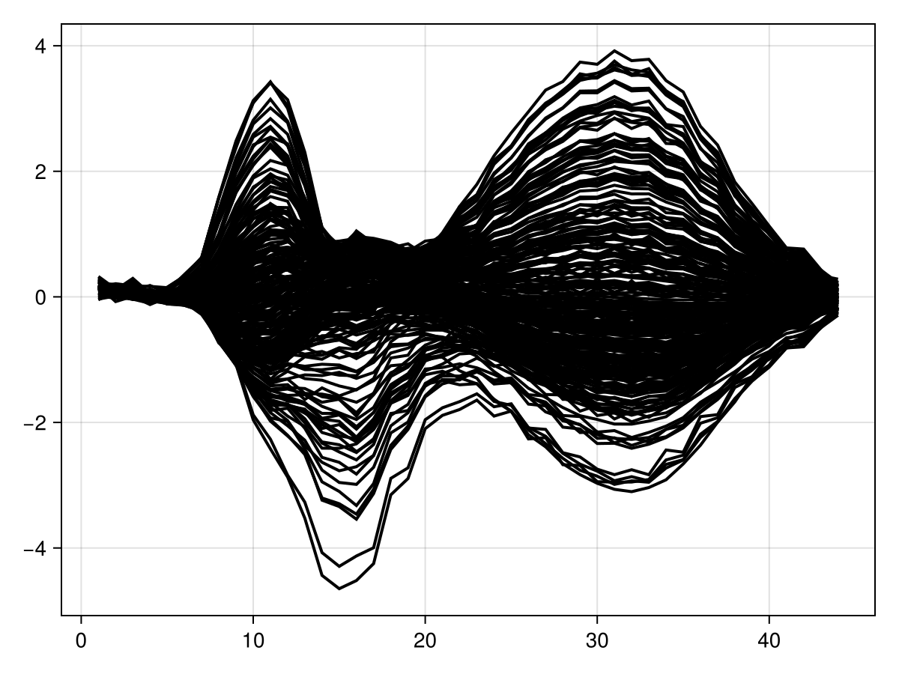
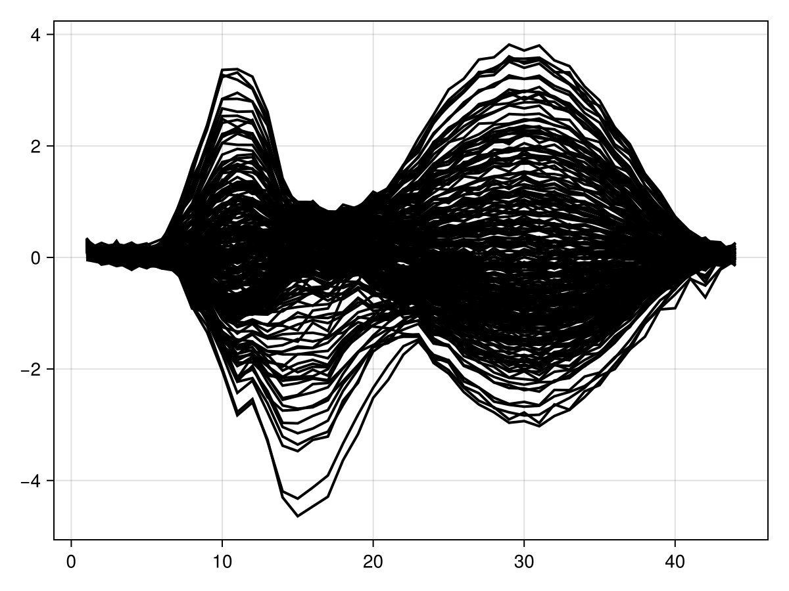
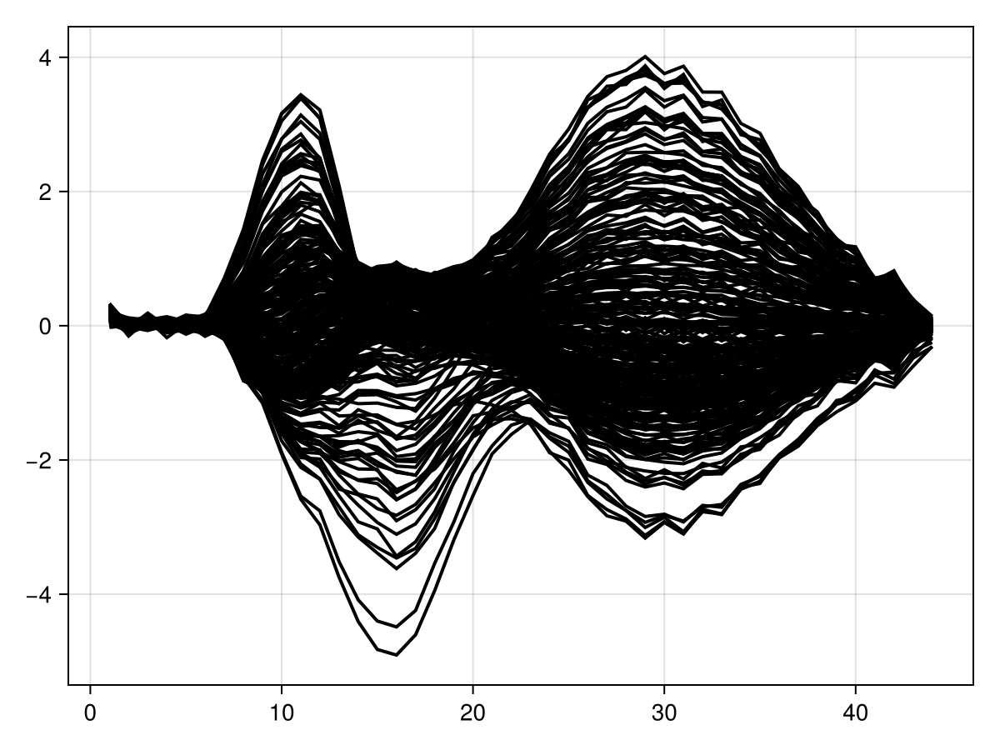
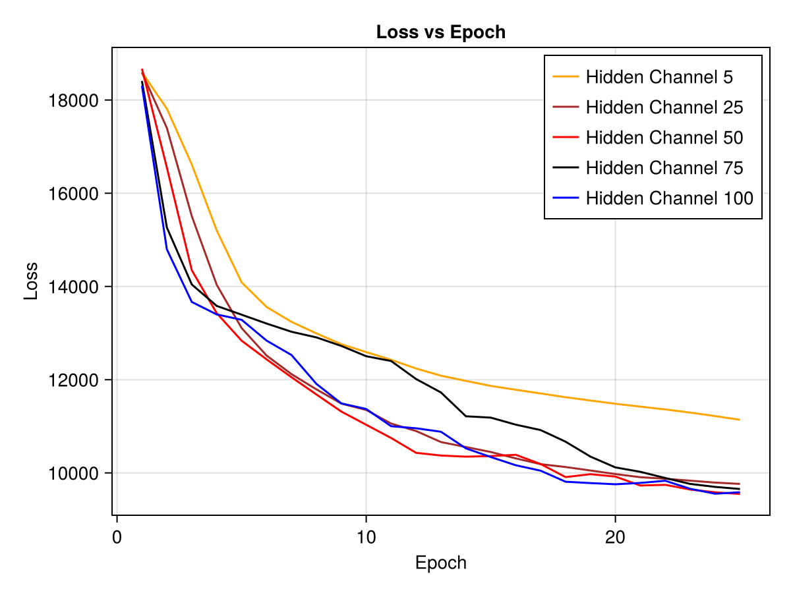

# hidden_chs.jl Notebook Documentation

## Overview
This document provides an overview of a hidden_chs.jl notebook that utilizes deep recurrent encoding techniques with various hidden channel configurations. It demonstrates data simulation, model fitting, and visualization of results.

---

## Dependencies

### Julia Packages Used
```julia
using Pkg
Pkg.activate("../../docs")
```
```julia
using Random
using PlutoLinks
using Lux
using LuxCUDA
using CairoMakie
using Statistics
using StatsModels
using StableRNGs
```
```julia
@revise using DeepRecurrentEncoder
```

## Data Preparation

### Load package to generate test data
```julia
testdata = @ingredients("../testdata.jl")
```

Define a random number generator for the data generation module
```julia
rng = StableRNG(1)
```

### Define Statistical formula for stimuli data
```julia
f = @formula 0 ~ 0 + sight + hearing
```

### Simulate Data
```julia
data, evts = testdata.simulate_data(rng, 100; sfreq=100, sight_effect=1);
```

## Model Training

### Define Parameters 

Defining some variables to hold the results of training and testing

```julia
use_gpu = false
```
Enable/disaible GPU usage

```julia
lossepochdata = []
lossepochrsquareddata = []
loss_test_rsquared = []
hidden_channels = [10,25,50,75,100]
y_pred = zeros(5, 44, 227, 10)
```

### Train Model with Different Hidden Channels
This trains a Deep recurrent encoder for different hidden channel configurations. Currently, the model is being tested for hidden channels [10, 25, 50, 75, 100]
```julia
for k in 1:5
	dre,ps, st, loss_epoch_data, loss_epoch_rsquared_data = fit(DRE, Float32.(data[:,1:end÷2*2,:])|> x->use_gpu ? CuArray(x) : x,f,evts;n_epochs=25,lr=0.1,batch_size=256, hidden_chs = hidden_channels[k])# |> CuArray)
	l,y_pred[k,:,:,:] = DeepRecurrentEncoder.test(dre,(Float32.(data[:,1:end÷2*2,:])|> x->use_gpu ? CuArray(x) : x),f,evts,ps,st;subset_index=1:100,loss_function = mse)
	push!(lossepochdata, loss_epoch_data)
	push!(lossepochrsquareddata, loss_epoch_rsquared_data)
	push!(loss_test_rsquared,l)
end
```

---

## Visualization

Now, we try to visualize the results. Here, we also highlight the advantages and drawbacks of increasing the latent space size

### Mean of input data

```julia
series(mean(data, dims=3)[:, :, 1]; solid_color=:black)
```


### Mean Predictions for Different Hidden Channels
```julia
series(mean(y_pred[1, :, :, :], dims=3)[:, :, 1]'; solid_color=:black)
series(mean(y_pred[2, :, :, :], dims=3)[:, :, 1]'; solid_color=:black)
series(mean(y_pred[3, :, :, :], dims=3)[:, :, 1]'; solid_color=:black)
series(mean(y_pred[4, :, :, :], dims=3)[:, :, 1]'; solid_color=:black)
series(mean(y_pred[5, :, :, :], dims=3)[:, :, 1]'; solid_color=:black)
```
**_Image Placeholder: Insert visualizations for each hidden channel prediction here_**






### Loss vs Epoch Plot
```julia
flattened_data_lossmse = []
line_color_lossmse = [:orange, :brown, :red, :black, :blue]
labels_lossmse = ["Hidden Channel 10", "Hidden Channel 25", "Hidden Channel 50", "Hidden Channel 75", "Hidden Channel 100"]
for k in 1:5
    push!(flattened_data_lossmse, [x[1] for x in lossepochdata[k]])
end
fig_lossmse = Figure()
ax_lossmse = Axis(fig_lossmse[1, 1], title="Loss vs Epoch", xlabel="Epoch", ylabel="Loss")
for (i, data_lossmse) in enumerate(flattened_data_lossmse)
    lines!(ax_lossmse, 1:length(data_lossmse), data_lossmse, label=labels_lossmse[i], color=line_color_lossmse[i])
end
axislegend(ax_lossmse)
fig_lossmse
```


---

## Conclusion
This notebook demonstrates data simulation, model training, and visualization of deep recurrent encoding with different hidden channel sizes. The results provide insights into the effectiveness of different hidden channel configurations in predicting time-series data.
